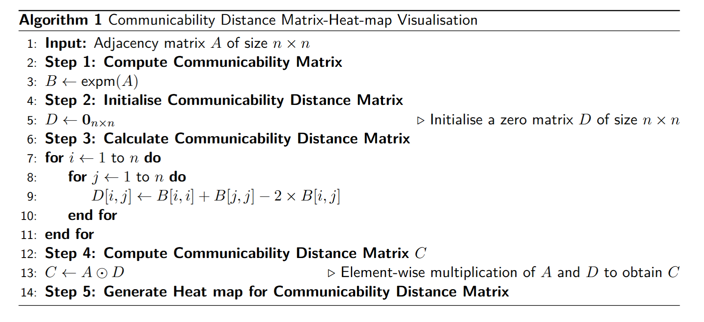

# Optimizing Cost in Transportation Networks

## Project Overview
This project focuses on proposing methods and techniques to address inefficiencies in global transportation network design. By studying various network distance measures, we implemented Python-based analysis to evaluate their performance across different transportation datasets.

### Project Supervisor
**Dr. Philip Knight** – University of Strathclyde

### Author
**Oumarou Moussa Bola**

## Repository Contents
This repository includes materials related to our analysis of transportation networks. Specifically, it contains one of six Jupyter notebooks that focus on the **Paris dataset**. The structure of this notebook is similar to the other five in the project.

Inside this repository, you will find:
- **Jupyter Notebook**: The Python implementation for analyzing the Paris transportation network.
- **Dataset**: The Paris Network dataset used in our study.
- **Generated Images**: Visualizations from previous simulations.

## Theoretical Background

### Problem Definition
Transportation networks often lack optimal efficiency, leading to increased travel costs, congestion, and environmental impacts like CO₂ emissions. The goal of this study is to explore network distance metrics and develop strategies to optimize these networks, making them more cost-effective and sustainable.

---

### Communicability

The analysis of complex networks has demanded an increasing number of theoretical tools needed for extracting useful information about their non trivial structured. Many of the topological properties that produce the unique features of complex network emerge naturally by embedding them into hyperbolic space. In fact the communicability function provides information about how well-communicated a pair of nodes is in a connected network. The communicability between the pair of nodes $(p,q)$ is given by equation below. Given that most of the transportation network we will deal with in this work are undirected, by using the spectral theorem the communicability function can be expressed as:

$$
C_{pq}=\sum\limits_{j=1}^n\phi_{j}(p)\phi_{j}(q)e^{\lambda_{j}}
$$

Where $\phi_{j}(p),\phi_{j}(q)$ are respectively the $p^{th}$ and $q^{th}$ element of the $j^{th}$ orthonormal eigenvector of the adjacency matrix associated with the eigenvalue $\lambda_{j}$.

In order to fully understand the communicability function, it is interesting to look at the physical analogy of this concept. Indeed by considering the network as a quantum harmonic oscillator system submerged into a thermal bath with inverse temperature given by 

$$
\beta =\frac{1}{kT}
$$

where, $k$: Boltzmann constant, the communicability between any pair of nodes $(p,q)$ in the network is: 

$$
C_{pq}=(\exp(\beta A))_{pq}=\sum\limits_{j=1}^n \phi_{j}(p)\phi_{j}(q)e^{\beta\lambda_{j}}
$$

It represents the thermal green function of the system and indicates how a thermal oscillation is propagated from one node to another in the network.

#### Scaled communicability
In order to compare communicability in different networks, It might be useful to scale the communicability metric so that it lies between $[0-1]$. Hence using the min-max scaling strategy, the communicability between any pairs of nodes $(p,q)$ is normalized as follow:

$$
\widetilde{C_{pq}}=\frac{C_{pq}-\text{min}(C_{pq})}{\text{max}(C_{pq})-\text{min}(C_{pq})}
$$

#### Communicability distance
The communicability between the pair of nodes $(p,q)$, $C_{pq}$ accounts for the amounts of information that departs from $p$ and successfully arrives at $q$. Thus $C_{pq}$ measures how a perturbation propagates from node $p$ to node $q$. On the other hand, the self communicability $C_{pp}$ (respectively $C_{qq}$) represents the disruption in the communication. In fact it quantifies the way in which an excitation at node $p$ propagates throughout the network before coming back and being absorbed by that node. Therefore, to quantify the difference between the amount of perturbation that is absorbed between pairs of nodes in a network and the amount of perturbation that is propagated between them, the following metric has been defined:

$$
\xi_{pq}:=C_{pp}+C_{qq}-2C_{pq}
$$

This metric is very useful as it allows us to extract relevant insight about the network structure.

**Proposition.** $\xi_{pq}$ is the square of the communicability distance between the pair of nodes $(p,q)$ and it is an Euclidean distance.  

**Proof.**  
We have $\xi_{pq}=C_{pp}+C_{qq}-2C_{pq}$. From the communicability equation we have:

$$
C_{pq}=\sum\limits_{k=0}^{\infty}\frac{(A^k)_{pq}}{k!}.
$$

Since we are dealing with undirected networks, it follows that $A$ is symmetric. Therefore the spectral theorem implies that $A$ is orthogonally diagonalisable,

$$
A=Q\Delta Q^T
$$

with 
- $\Delta$: Diagonal matrix containing the eigenvalues of $A$  
- $Q=[\phi_1,\cdots,\phi_n]$: Orthogonal matrix containing the eigenvectors associated with $\lambda_i$

We can rewrite $C_{pq}$ as 

$$
C_{pq}=\sum\limits_{k=1}^n\phi_{k}(p)\phi_{k}(q)e^{\lambda_k} 
$$

with $|V(G)|=n$. Thus using the equation \eqref{sec: comfunc} we can write 

$$
\begin{aligned}
\xi_{pq} &=\sum\limits_{k=1}^n\phi_{k}(p)^{2}e^{\lambda_k}+\sum\limits_{k=1}^n\phi_{k}(q)^{2}e^{\lambda_k}-2\sum\limits_{k=1}^n\phi_{k}(p)\phi_{k}(q)e^{\lambda_k} \\
&=\sum\limits_{k=1}^n\left(\phi_k(p)^2+\phi_k(q)^2-2\phi_k(p)\phi_k(q)\right)^2e^{\lambda_{k}} \\
&=\sum\limits_{k=1}^ne^{\lambda_{k}}\left(\phi_k(p)-\phi_k(q)\right)^2  \geq 0  \text{ , thus } \xi_{pq} \text{ is non negative}
\end{aligned}
$$

Also, 

$$
\xi_{pq}=0 \Longleftrightarrow C_{pp}=C_{qq}=C_{pq}=0  \Longleftrightarrow p=q 
$$

Thus the identity axiom holds. Moreover, the symmetric property of $\xi_{pq}$ follows naturally given that $C_{pq}$ is symmetric

$$
\begin{aligned}
\xi_{pq}&=C_{pp}+C_{qq}-2C_{pq} \\
&=C_{pp}+C_{qq}-2C_{qp} \\
&=\xi_{qp}
\end{aligned}
$$

Furthermore, using the spectral decomposition theorem we have:

$$
A^k=Q\Delta^kQ^T=\sum\limits_{j=1}^n\lambda_j^k\phi_{j}\phi_{j}^T
$$

where $\phi_{j}\phi_{j}^T$ is the projection matrix on the $\text{j}^{\text{th}}$ eigenvector such that 

$$
\phi_{j}\phi_{j}^T = 
\begin{bmatrix}
\phi_{j}(1)\\
\phi_{j}(2)  \\
\vdots\\
\phi_{j}(n) 
\end{bmatrix}
\begin{bmatrix}
\phi_{j}(1) & \phi_{j}(2) & \cdots & \phi_{n} \\
\end{bmatrix}  \\
=\begin{bmatrix}
\phi_{j}(1)\phi_{j}(1) & \phi_{j}(1)\phi_{j}(2) & \cdots & \phi_{j}(1)\phi_{j}(n)\\
\phi_{j}(2)\phi_{j}(1) & \phi_{j}(2)\phi_{j}(2) & \cdots &\phi_{j}(2)\phi_{j}(n) \\
\vdots & \vdots & \ddots & \vdots \\
\phi_{j}(n)\phi_{j}(1)& \phi_{j}(n)\phi_{j}(2) & \cdots & \phi_{j}(n)\phi_{j}(n)
\end{bmatrix}
$$

Using this we can write $\xi_{pq}$ as 

$$
\begin{aligned}
\xi_{pq}&=\sum\limits_{k=1}^n\frac{(A^k)_{pp}}{k!}+\sum\limits_{k=1}^n\frac{(A^k)_{qq}}{k!}-2\sum\limits_{k=1}^n\frac{(A^k)_{pq}}{k!} \\
&=\sum\limits_{j=1}^n\phi_{p}(j)\phi_{p}(j)^Te^{\lambda_{j}} +\sum\limits_{j=1}^n\phi_{q}(j)\phi_{q}(j)^Te^{\lambda_{j}} -\sum\limits_{j=1}^n\phi_{p}(j)\phi_{q}(j)^Te^{\lambda_{j}} -\sum\limits_{j=1}^n\phi_{q}(j)\phi_{p}(j)^Te^{\lambda_{j}}  \\
&=(\phi_{p}-\phi_{q})^Te^{\Delta}(\phi_{p}-\phi_{q})  \\
&=(\phi_{p}-\phi_{q})^Te^{\frac{\Delta}{2}}e^{\frac{\Delta}{2}}(\phi_{p}-\phi_{q}) \\
&=(e^{\frac{\Delta}{2}}\phi_{p}-e^{\frac{\Delta}{2}}\phi_{q})^T(e^{\frac{\Delta}{2}}\phi_{p}-e^{\frac{\Delta}{2}}\phi_{q})
\end{aligned}
$$

By letting $x_{p}=e^{\frac{\Delta}{2}}\phi_{p}$,

$$
\begin{aligned}
\xi_{pq}&=(x_p-x_q)^T(x_p-x_q) \\
&=||x_p-x_q||^2 
\end{aligned}
$$

Thus,

$$
||x_p-x_q||= \sqrt{ \xi_{pq}}=\sqrt{||x_p||^2+||x_q||^2-2x_p.x_q}
$$

Hence  $\sqrt{ \xi_{pq} }$  is an Euclidean distance, in fact it is the communicability distance between the pair of nodes $(p,q)$.

---

### Novel hybrid measure of network distances

In this section we introduce a new metric that will combine several measures of network distances that we will penalise by certain parameters that will be defined in the subsequent lines. To achieve the former goal, we need to define a metric that will quantify the amount of $\text{CO}_2$ that is emitted between two destinations in a given transportation network. Let's define 

$$
d_{co_2}(p,q)=\displaystyle{\sum\limits_{e_i \in \widetilde{S}(p,q)}E(e_i) }
$$

Where 
- $E(e_i)$: represents the weights of an edge $e_i$ in terms of $\text{CO}_2$ emitted thus a positive quantity;  
- $\widetilde{S}(p,q)$: represents the sets of edges in the shortest path between the nodes $p$ and $q$.

**Proposition.**  
The introduced $\text{CO}2$ emission quantification metric $d_{CO_2}$ is a valid distance.

**Proof.**  
For $d_{co_2}$ to be a distance, it needs to satisfy the distance axioms:

(i) **Non-negativity and identity:**

By assumption $\forall i ,E(e_i)\geq 0  \Longrightarrow d_{co_2}=\sum\limits_{e_i \in \widetilde{S}(p,q)}E(e_i) \geq 0$ 

Also, 

$$
\begin{aligned}
d_{co_2}(p,q)=\displaystyle{\sum\limits_{e_i \in \widetilde{S}(p,q)}E(e_i) }=0 &\Longleftrightarrow E(e_1)+E(e_2)+\cdots=0 , \text{ since } E(e_i)\geq 0\\ 
&\Longleftrightarrow E(e_1)=E(e_2)=\cdots=E(e_n)=0 \\
&\Longleftrightarrow p=q  
\end{aligned}
$$

Thus the identity axioms holds and $d_{co_2}$ is non-negative.

(ii) **Symmetry:**

$$
\begin{aligned}
d_{co_2}(p,q)&=\displaystyle{\sum\limits_{e_i \in \widetilde{S}(p,q)}E(e_i) }\\
&=\displaystyle{\sum\limits_{e_i \in \widetilde{S}(q,p)}E(e_i) }\\
&=d_{co_2}(q,p)
\end{aligned}
$$

Thus  $d_{co_2}$ is symmetric.

(iii) **Triangle inequality:**

Let $p,q,w \in V(G)$, where $V(G)$ is the set of vertices in the network $G$. We know that the length of the shortest path satisfies the triangular inequality:

$$
\left|\widetilde{S}(p,q)\right| \leq \left|\widetilde{S}(p,w)\right| + \left|\widetilde{S}(w,q)\right|
$$

This simply means that the number of edges in the shortest path between $p$ and $q$ is less than or equal to the sum of the number of edges in the shortest path between $(p,w)$ and $(w,q)$. Thus it follows 

$$
\begin{aligned}
d_{co_2}(p,q)&=\displaystyle{\sum\limits_{e_i \in \widetilde{S}(p,q)}E(e_i) }\\
&\leq \displaystyle{\sum\limits_{e_i \in \widetilde{S}(p,w)}E(e_i) } + \displaystyle{\sum\limits_{e_j \in \widetilde{S}(w,q)}E(e_j) } \\
&\leq d_{co_2}(p,w) +d_{co_2}(w,q)
\end{aligned}
$$

Hence the triangular inequality holds which finally implies $d_{CO_2}$ is a distance.

We are now ready to define our new hybrid measure of network distances as a weighted sum of the environmental impact contribution ($\text{CO}_2$ emitted), the shortest path distance contribution and the communicability distance contribution. Define

$$
H_{pq}=\alpha d_{p,q} + \beta d_{co_2}(p,q) + \gamma C_{pq}
$$

with $\alpha$, $\beta$, $\gamma \geq 0$ positive constant parameters determining the significance of each metric. We need to check whether $H$ is a valid metric.

**Proposition.**  
The novel hybrid measure of network distance $H$ is a valid distance function on $V(G)$.

**Proof.**  
For $H$ to be a distance, it needs to satisfy the distance axioms:

(i) **Non-negativity and identity:**

$$
H_{pq}=\alpha d_{p,q} + \beta d_{co_2}(p,q) + \gamma C_{pq} \Rightarrow H_{pq} \geq 0
$$

because by definition of the distance: $d_{pq} \geq 0$ , $d_{co_2} \geq 0$ , $C_{pq} \geq 0$

Thus $H_{pq}$ is non-negative.

Also,

$$
\begin{aligned}
H_{pq}=0 &\Longleftrightarrow \alpha d_{pq} + \beta d_{co_2}(p,q) + \gamma C_{pq} =0 \\
&\Longleftrightarrow \alpha d_{pq}= \beta d_{co_2}(p,q)=\gamma C_{pq} =0 \\
& \Longleftrightarrow p=q
\end{aligned}
$$

Hence the identity axiom holds.

(ii) **Symmetry:**

$$
\begin{aligned}
H_{pq} &=\alpha d_{pq} + \beta d_{co_2}(p,q) + \gamma C_{pq} \\
&=\alpha d_{qp} + \beta d_{co_2}(q,p) + \gamma C_{qp} \\
&=H_{qp}
\end{aligned}
$$

Thus $H$ is symmetric.

(iii) **Triangle inequality:**
Let $p,w,q \in V(G)$, we have 

$$
H_{pq}=\alpha d_{pq} + \beta d_{co_2}(p,q) + \gamma C_{pq}
$$

Since $d_{pq}$, $d_{co_2}$ and $C_{pq}$ are all measures of distances, it follows

$$
\begin{aligned}
H_{pq} &\leq \alpha \left( d_{pw}+d_{wq} \right)+\beta\left(d_{co_2}(p,w)+d_{co_2}(w,q)\right)+\gamma \left(C_{pw}+C_{wq}\right)  \\
&\leq \left(\alpha d_{pw}+\beta d_{co_2}(p,w)+C_{pw}\right) +\left(\alpha d_{wq}+\beta d_{co_2}(w,q) +\gamma C_{wq}  \right) \\
&\leq H_{pw} + H_{wq}    
\end{aligned}
$$

Hence (i), (ii) and (iii) imply that $H$ is a valid measure of distance.

---
## Communicability Distance Matrix

To implement the novel hybrid measure, we first need to compute the communicability distance matrix. This will provide the foundation for analysing the effectiveness of the new measure and for comparing the communicability shortest path distance with the regular shortest path distance.

### **Definition — Communicability Distance Matrix**

Let $G=(V,E)$ be a network, and let

$$
S=[C_{11},C_{22},\cdots,C_{nn}]^T
$$

Where \( S \) is a column vector of the self communicabilities of every node in the network. Let

$$
D=S\mathbf{e}^T+\mathbf{e}S^T-2C
$$

With:

 - The communicability function matrix defined as:
 
  $$
  C=\left(C_{pq}\right)_{1\leq p,q \leq n}=\text{exp}(A)
  $$
  
- and the following column vector of ones:
  
  $$\mathbf{e}=\mathbf{1}_{n\times 1}=[ 1,1,\cdots,1 ]^T$$  

The communicability distance matrix of the network \( G \) is then given by:

$$
\overline{C}(G)=\sqrt[0]{D}
$$

Where $\sqrt[0]{}$ is the component-wise square root.

---

## Strategy Implementation Road Map

Using the definition above and considering the fact that in a transport network, the shortest path is not necessarily the most efficient path either in terms of travelling time, congestion or environmental impact, we suggest the following road map:

### a) **Implementation of the Communicability Distance in Python**

The first step consists of implementing the communicability distance function in Python.  
The implemented algorithm is given below:

####   **Algorithm 1: Communicability Distance Matrix — Heat-map Visualisation**

  

### b) **Compare the shortest path distances**

Subsequently, we suggest comparing the **communicability shortest-path distance** with the **regular shortest-path distance** obtained using **Dijkstra’s algorithm**.

### **Algorithm — Dijkstra’s Algorithm (Single Source)**  

  

  

  

